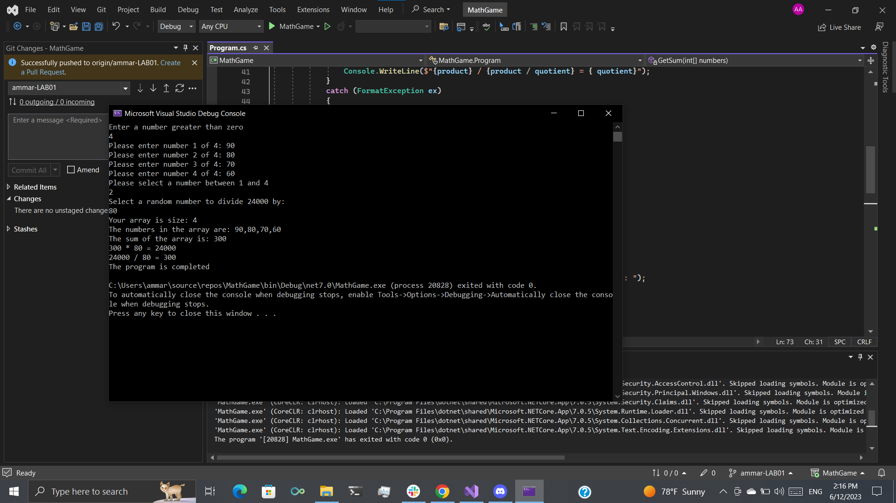

# MathGame
It is a math game,this program ask the user to choose number greater than 0 and if he/she choose 0 it will give it an Exception ("Invalid size selected"),
then it take the number and put it as array[index] and then will ask him/her to fill the array number by number then will sumation the numbers then it will ask the user to choose number between 1 and array.lenght and it will multplay the array[choosenNumber] with the sum of the array numbers then ask the user to chooes random number to divide (sum*array[choosenNumber] ) on it then the out put will be like this 
